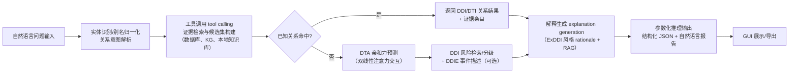
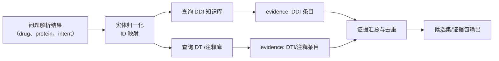
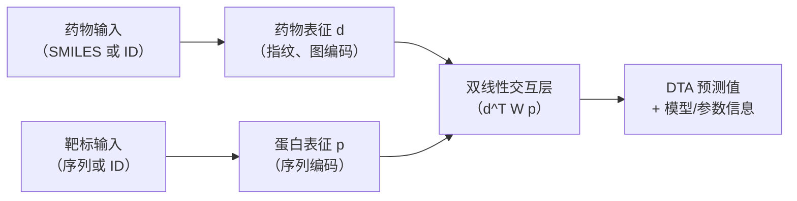
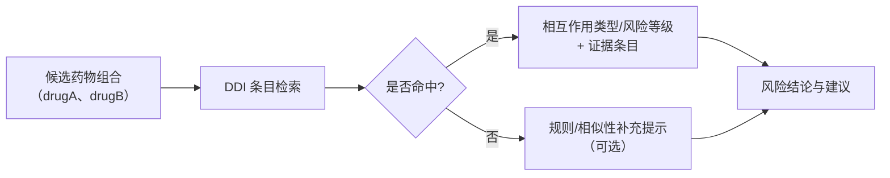
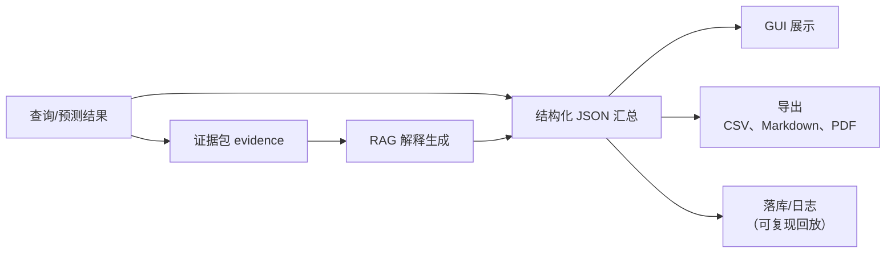
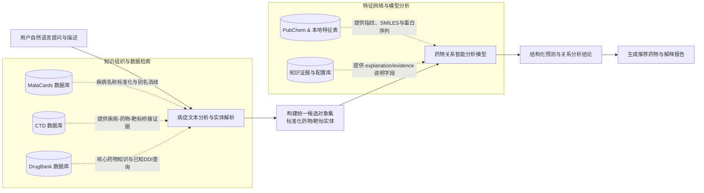
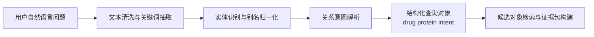
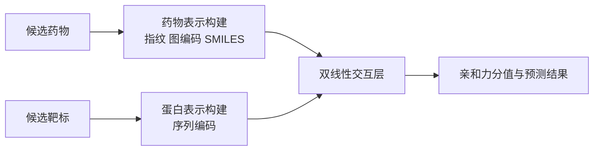
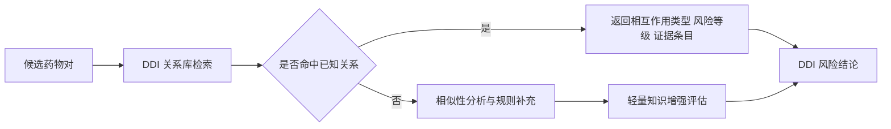

# 大学生创新训练项目申请书

## 封面信息页

项目编号：

项目名称：面向自然语言交互的药物关系智能分析系统研究与实现

项目负责人：[填写姓名]

联系电话：[填写手机号]

所在学院：[填写学院]

学号：[填写学号]

专业班级：[填写专业班级]

指导教师：[填写指导教师姓名]

E-mail：[填写邮箱]

申请日期：[填写日期]

起止年月：[建议填写为 2026 年 3 月至 2027 年 3 月，或按学校通知填写]

## 一、基本情况

项目名称：面向自然语言交互的药物关系智能分析系统研究与实现

所属学科：

学科一级门：工科

学科二级类：人工智能 / 计算机类

申请金额：9000 元

起止年月：[按学校要求填写]

负责人姓名：[填写姓名]

性别：[填写]

民族：[填写]

出生年月：[填写]

学号：[填写]

联系电话：[填写]

指导教师：[填写]

指导教师联系电话：[填写]

### 1. 负责人曾经参与科研的情况

申请人长期参与程序设计、数学建模和人工智能相关课程训练，具备较扎实的算法基础与 Python 编程能力，能够完成药物与蛋白数据整理、预测脚本运行、模型结果分析和实验复现等工作。前期已接触 PyTorch 深度学习框架、MySQL 数据库基本操作、图数据处理方法和图形界面开发，能够开展文献调研、数据清洗、结果可视化和技术文档撰写。依托现有项目代码，申请人已参与药物数据预处理、预测模块调用、界面功能测试和项目材料整理等工作，对本项目涉及的关系查询、模型预测、结果展示与系统集成任务具有一定实践基础。

如你有竞赛或课程经历，可以在此补入：如数学建模竞赛、蓝桥杯、人工智能课程项目、科研立项经历、获奖情况等。

### 2. 指导教师承担科研课题情况

指导教师长期从事人工智能、图数据分析、生物网络计算或药物智能分析相关研究，在图神经网络、符号图、网络数据分析和智能软件系统开发方面具有较好的研究积累。近年来承担过多项与本项目相关的科研课题，为本项目开展提供了明确的研究方向、方法基础和科研指导条件。

此处建议你与导师确认后替换为真实项目，例如：

1. [项目来源]，[项目编号]，[项目名称]，[起止时间]，[在研/结题]，[主持/参与]。
2. [项目来源]，[项目编号]，[项目名称]，[起止时间]，[在研/结题]，[主持/参与]。
3. [项目来源]，[项目编号]，[项目名称]，[起止时间]，[在研/结题]，[主持/参与]。

### 3. 指导教师对本项目的支持情况

1. 指导教师通过开设项目制课程与训练环节（如《人工智能与数学建模竞赛》），帮助项目组成员夯实图神经网络与工程实现能力，使成员能够熟练使用 PyTorch Geometric（PyG）等工具链，为后续 DDI/DTI/DTA 相关建模、特征构建与实验复现提供能力保障。
2. 指导教师为本项目提供课题组既有成果与工程资料支持，包括既往相关软件著作权材料（如“基于符号网络的药物靶标关系预测查询软件”）的设计说明书、源代码与交付文档，便于本项目在数据库组织、接口封装、系统可复现与软件化交付方面快速对齐规范。
3. 指导教师开放并组织每周课题组研究生组会，指导项目成员系统阅读 DDI 可解释生成（ExDDI）、知识增强 DDI（PKAG-DDI）以及多智能体工具调用（DrugAgent）、参数化推理（DrugPilot）等前沿工作，帮助成员掌握关键术语、实验设置与评价指标，并进行阶段性汇报与问题复盘。
4. 指导教师结合课题组研究基础，对本项目的关键环节开展持续指导：包括药物/靶标数据规范化与证据检索（RAG）、DTA 预测模块与消融实验设计、DDI 风险评估策略、结构化中间结果与日志审计机制、以及 GUI/数据库/导出等系统集成工作，确保项目按期形成可演示、可验收的原型系统。

### 4. 项目组主要成员

| 姓名 | 学号 | 专业班级 | 所在学院 | 项目中的分工 |
| --- | --- | --- | --- | --- |
| [负责人姓名] | [学号] | [专业班级] | [学院] | 系统总体设计、申请书撰写、模块整合 |
| [成员 2] | [学号] | [专业班级] | [学院] | 数据整理、数据库查询模块实现 |
| [成员 3] | [学号] | [专业班级] | [学院] | 模型调用、预测模块联调 |
| [成员 4] | [学号] | [专业班级] | [学院] | 界面设计、结果展示与测试 |

## 二、立项依据

### （一）项目简介

药物关系分析是人工智能赋能药物研发和用药安全的重要研究方向之一，涵盖药物–药物相互作用（Drug–Drug Interaction，DDI）分析、药物–靶标相互作用（Drug–Target Interaction，DTI）预测，以及药物–靶标亲和力（Drug–Target Affinity，DTA）评估等关键问题。现有工具虽然在数据库检索或关系预测方面取得了一定进展，但大多以结构化输入为主，用户通常需要手动输入药物编号、标准字段或固定格式的数据，系统交互门槛较高。同时，大多数系统往往只覆盖“查询”或“预测”中的单一功能，缺乏从自然语言问题理解、已知关系检索、未知关系预测到自然语言解释输出的完整闭环。

本项目拟构建一个面向自然语言交互的药物关系智能分析系统。用户输入自然语言问题后，系统能够自动识别药物实体、靶标实体及关系意图，优先在知识库中查询已有关系；若数据库中不存在相应结果，则自动调用预测模型对潜在药物-靶标关系进行分析；最后输出结构化结果和自然语言解释说明。项目将结合现有药物数据、预测模型、数据库查询模块和图形界面基础，开发一个可演示、可扩展的小型原型系统。

该系统有望服务于药物关系学习、科研辅助分析和课程项目展示等场景，也能够为后续药物问答、可解释药物分析和多源证据融合等研究提供基础。

### （二）研究目的

随着药物研发数据规模的持续增长，如何高效理解药物之间及药物与靶标之间的关系，已成为智能药学研究中的关键问题。在实际科研和教学场景中，用户更倾向于通过自然语言表达需求，例如“某药和某蛋白是否有作用”“两种药是否存在相互影响”等，而不是先将问题转化为严格的数据库检索语句或结构化输入格式。因此，构建面向自然语言输入的药物关系智能分析系统具有明显的应用价值。

本项目的研究目的主要包括以下几个方面：

1. 降低药物关系分析系统的使用门槛，使用户能够通过自然语言直接提出药物分析需求。
2. 建立“已知关系优先查询、未知关系自动预测”的双通路机制，统一检索与预测流程。
3. 将药物关系分析结果由单一分值或标签输出提升为带有自然语言说明的解释性结果，提高系统可读性和可信度。
4. 在现有项目代码和模型基础上，完成一个具备演示能力的软件原型，为后续论文、竞赛和软件著作权申报提供基础材料。

### （三）研究内容

随着药物研发与用药安全数据规模持续增长，研究人员与临床人员在进行药物–药物相互作用（DDI）分析、药物–靶标相互作用（DTI）判断与药物–靶标亲和力（DTA）评估时，往往需要综合多源数据库、知识图谱（Knowledge Graph，KG）、文献证据与模型推断结果，人工检索与汇总耗时耗力。借鉴 DrugAgent（multi-agent LLM system）中“多智能体协作 + 工具调用（tool calling）+ 证据整合”的范式，并结合 DrugPilot 的参数化推理（parameterized reasoning）与结构化记录（structured record）思想，本项目设计并实现一套面向自然语言交互的药物关系智能分析系统：用户输入问题后，系统自动完成实体识别与意图解析，优先检索已知关系与证据；若知识库未命中，则调用 DTA 预测模型并结合 DDI 风险评估策略进行补充推断；最终生成“结构化结果 + 证据引用解释（rationale）+ 可导出报告”，形成可演示、可扩展、可审计的闭环原型（如图1所示）。

图1. 药物关系智能分析系统总体流程示意图

具体包括以下三个模块：

1. 基于提示的自然语言问题解析与证据检索（tool calling）
用户输入自然语言问题后，系统基于提示（Prompt）模板对文本进行结构化解析，抽取药物/靶标实体及其关系意图，并将实体映射为标准标识（如 `drug_id`、`protein_id`）。参考 DrugAgent 的角色化设计，可将该阶段划分为“协调（Coordinator）—检索（Search）—知识（KG）”等工具化子步骤，并通过工具调用访问本地数据库/知识库，返回可追溯的候选证据集合，为后续“查询优先、预测补充”的双通路提供统一输入（如图2所示）。

1.1 实体识别与关系意图解析（stepwise reasoning trace）
针对药物关系场景的自然语言表达灵活、别名多、缩写多等特点，研究并实现命名实体识别（NER）与关系意图解析策略：从用户问题中识别药物名称、蛋白/靶标名称与关系类型（例如“是否存在相互作用”“是否可能结合”“亲和力大致水平”等），并完成同义词/别名归一化。为提升可复现性与可审计性，系统记录步骤化推理轨迹（reasoning trace），并可参考 Chain-of-Thought（CoT）与 ReAct（Reason+Act）框架，将“推理—工具调用—观测（observation）”过程以结构化日志形式保存。

1.2 证据检索与候选集构建（evidence package）
根据解析得到的标准化实体，系统对 DDI/DTI 结构化条目、药物与靶标基础注释、KG 证据与已知相互作用证据等进行检索与聚合，形成统一的 `evidence` 包（包含来源、条目 ID、摘要字段、检索时间与工具参数等）。该证据包既用于“已知关系直接返回”，也用于“预测结果的解释引用”，从机制上实现 ExDDI 所强调的“结论—依据（rationale）”对齐与可追溯。

图2. 证据检索与候选集构建示意图

2. DTA 预测与 DDI 风险评估（查询未命中时的“预测补充”）
当知识库无法直接命中所需 DDI/DTI 关系时，系统进入预测与评估通路：在 DTA 预测侧对“药物–靶标亲和力”进行数值化评估；在 DDI 评估侧对候选药物组合进行风险检索与分级，输出风险类型、等级与对应证据条目。该模块既支持转导（transductive）场景，也考虑在新药/新靶标下的归纳（inductive）场景鲁棒性；并可扩展输出 DDI event（DDIE）风格的事件描述文本，用于更贴近实际用药安全表述（如图3、图4所示）。

2.1 双线性注意力 DTA 亲和力预测（drug–target affinity prediction）
构建药物表示 $d$ 与蛋白表示 $p$，在交互层引入双线性交互/双线性注意力（例如 $d^T W p$ 或分块双线性映射）以显式建模药—靶高阶关联。参考 PKAG-DDI 对分子模态的组织方式，系统在药物侧支持多种分子模态（molecular modalities），例如基于 RDKit 的分子指纹（fingerprint）与分子图（molecular graph，原子为节点、化学键为边）编码；并支持以药物 SMILES（Simplified Molecular Input Line Entry System）串或药物标识作为输入。模型输出包括亲和力预测值、模型版本与推理参数，便于实验复现与结果追踪。

图3. 双线性交互 DTA 预测流程示意图

2.2 轻量知识增强的 DDI 风险检索与分级（knowledge-augmented）
为保证项目周期内可稳定交付，DDI 评估以“结构化检索 + 规则/打分”为主线：基于药物对查询 DDI 知识库，得到相互作用类型与风险等级，并返回证据条目与用药建议（禁忌/慎用/监测建议等）。术语与机制上可对齐 PKAG-DDI 的“成对知识增强（pairwise knowledge-augmented）”思想：在检索阶段引入药物对的成对知识选择（Pairwise Knowledge Selector，PKS）与知识融合策略（pairwise knowledge integration strategy）的轻量化实现（以规则/模板替代大模型训练），并可选生成 DDIE（Drug–Drug Interaction Event）事件式文本描述，便于直接用于报告段落。

图4. DDI 风险检索与分级示意图

3. 证据驱动的可解释报告生成与原型系统实现（ExDDI-style explanation）
在得到“查询结果/预测结果/风险结论”后，系统以证据包为中心组织输出：先生成结构化 JSON（JavaScript Object Notation，用于 GUI 展示、落库与审计回放），再生成自然语言解释报告，并要求关键结论与证据条目一一对应（RAG 证据驱动）。解释文本可参考 ExDDI 的 explanation generation 设定，强调对 DDI 预测/检索结论给出可读的 rationale（例如相互作用机制线索与证据来源）。最后将各模块封装为可调用工具，完成 GUI/命令行一键运行、日志记录与结果导出，实现可演示的原型系统（如图5所示）。

3.1 RAG 约束下的解释生成与结构化输出（structured output）
围绕 DDI/DTI/DTA 的关键结论生成解释文本，并在解释中显式引用 `evidence` 条目（来源、ID、摘要字段），输出包含：关系结论、预测数值、风险等级、证据引用、模型版本与推理参数等字段的结构化结果，保证可追溯与可复现。为提升可控性，参考 DrugPilot 的 parameterized reasoning 思想，将关键中间变量（如工具参数、检索命中条目、规则触发原因、模型版本等）以结构化字段固化；并可参考 ExDDI 的评估思路，在项目验收阶段对解释进行自动指标与人工评审（human evaluation）相结合的可用性评价。

3.2 原型系统集成与案例展示
基于现有数据库连接模块、预测脚本与 GUI 程序，完成端到端联调，实现输入、检索、预测、解释、导出的一体化流程，并通过典型案例展示系统效果与可用性。

注：CSV（Comma-Separated Values）、Markdown、PDF（Portable Document Format）为常用导出格式。

图5. 证据驱动解释生成与系统交付示意图

### （四）国内外研究现状和发展动态

近三年来，国内外药物关系智能分析研究呈现出“更强表征学习 + 更强任务适配 + 更强可解释与系统化落地”的发展态势：一方面，围绕药物—药物相互作用（Drug–Drug Interaction，DDI）、药物—靶标相互作用（Drug–Target Interaction，DTI）与药物—靶标亲和力（Drug–Target Affinity，DTA）等核心任务，深度学习模型不断引入多模态信息、知识增强与更细粒度的交互类型刻画；另一方面，大语言模型（Large Language Model，LLM）及其智能体（Agent）工作流在科研任务组织、工具调用与结构化输出方面快速演进，使“可交互、可审计、可复现”的药物分析原型系统成为可行方向。

从研究支撑与技术外溢来看，相关工作既包括通用/大规模生物医学 AI 的系统化探索[1]，也包括传统 DDI 预测建模（基于相似性集成与神经网络等）[2]；在医疗对话与知识注入方面，出现了面向医疗问答与对话数据的开源数据集与模型实践（如 ChatDoctor、Huatuo、MedDialog 等）[3][4][5]，并可借鉴自动化提示学习（AutoPrompt）为药物领域提示设计提供方法参考[6]。国内研究中也有基于对话结构、图注意力网络与图卷积/图嵌入等思路的相关研究，为图结构建模与系统交互提供旁证[7][8][9]。在图提示学习与多任务提示方向，All-in-One 与 DDI 事件图提示等工作展示了“预训练 + 提示/微调”的可迁移范式[10][11]，并可参考提示式微调在图任务中的一般化经验（如 CIKM 的相关实践）[12]。综述与经典网络药理研究则从宏观角度总结了深度学习药物发现的挑战与路径[13]，并以转录组响应与网络方法推动药物作用机制发现、药物重定位与药物组合预测[14][15]。更重要的是，本项目在系统与方法设计上将直接吸收并落地 5 篇核心文献中的关键思想：面向 DTI 推理的多智能体协作与工具使用（DrugAgent）[16]、参数化推理与结构化记录（DrugPilot）[17]、面向药物发现编程自动化的多智能体协作框架（DrugAgent-AutoProg）[18]、面向 DDI 的自然语言解释生成（ExDDI）[19]、以及面向 DDI 事件文本生成的成对知识增强机制（PKAG-DDI）[20]。

在 DDI/DTI/DTA 预测建模方面，国际上持续推进面向真实用药场景的细粒度任务定义，例如从二分类 DDI 走向“DDI 事件（DDI event）/机制类别”预测，并强调非对称交互与多模态融合等更贴近现实的设定。以近期工作为例，DDIPrompt 将 DDI 事件预测与图提示学习结合，面向罕见事件与数据稀缺问题进行建模[11]；同时，较早期的相似性集成与神经网络路线也仍是重要基线与工程化落地参考[2]。总体趋势是：从单一结构/序列输入，走向“结构 + 关系 + 外部知识”的联合建模，并在评测上更关注长尾标签与跨数据集泛化。

在“小样本/不平衡”条件下的任务适配方面，图提示学习（Graph Prompt Learning）成为近年热点之一。All-in-One 将多任务提示学习范式引入图神经网络，通过“预训练 + 提示”方式降低下游标注成本、提升迁移能力[10]；同时，提示式微调在图任务中的一般实践也提供了可复用的工程经验[12]，并可与 AutoPrompt 的“自动化提示”思想形成互补[6]。这一方向对 DDI/DTI/DTA 等“高成本标注 + 长尾分布”的药物任务尤为契合，为本项目在有限周期与有限数据条件下开展模型改进提供了方法学参照。

在“可解释输出”与“证据对齐”方面，研究开始从“只给预测分数/类别”走向“同时给出可读解释与可核验依据”。ExDDI 将 DDI 的解释生成作为核心目标，强调用自然语言给出可读的 rationale[19]；PKAG-DDI 进一步将“成对知识选择 + 融合”引入生成过程，用于生成更贴近机制表达的 DDI 事件文本[20]。上述工作为本项目构建“结果 + 证据 + 解释”的输出形态、并采用检索增强生成（Retrieval-Augmented Generation，RAG）思路组织证据包提供了直接参考。

在“LLM 智能体 + 工具调用（tool calling）”驱动的科研工作流方面，相关研究强调用多智能体分工协作与工具使用来组织复杂的药物关系推理任务（如整合模型预测、知识图谱与文献证据）[16]，并进一步从工程角度展示了多智能体在药物发现编程自动化中的价值（任务分解、代码执行与自我校验等）[18]。DrugPilot 则从“可控性与可审计性”出发，提出参数化推理与结构化记录以固化关键中间变量，便于复现与追踪[17]。相关趋势启示是：在药物关系分析系统中，通过“结构化中间结果 + 可审计日志 + 可复现回放”来约束与对齐 LLM 的行为，将更有利于落地展示与答辩验收。

综上，国内外最新发展正在把“预测模型、知识与解释、交互式系统”三者逐步打通，但多数研究仍聚焦于单一任务或离线评测，缺少一个能够面向自然语言用户、将“已知关系查询（DDI/DTI）+ 未知关系预测（DTA/模型推断）+ 证据驱动解释（RAG/自然语言解释）+ GUI 展示与导出”的闭环原型。基于此，本项目拟面向本科生可交付目标，围绕 DDI/DTI/DTA 任务构建药物关系智能分析系统：在数据与模型层吸收图提示学习与多模态/知识增强思路，在输出层引入证据对齐的可解释生成，在工程层落实结构化日志与可复现回放，从而形成可运行、可演示、可验收的系统原型。

参考文献：
[1].	Tu T, Azizi S, Driess D, et al. Towards generalist biomedical ai[J]. New England Journal of Medicine Artificial Intelligence, 2024, 1(3): AIoa2300138.
[2].	Rohani N, Eslahchi C. Drug-drug interaction predicting by neural network using integrated similarity[J]. Scientific Reports, 2019, 9(1): 13645.
[3].	Li Y, Li Z, Zhang K, et al. Chatdoctor: A medical chat model fine-tuned on a large language model meta-ai (llama) using medical domain knowledge[J]. Cureus, 2023, 15(6): e40895.
[4].	Wang H, Liu C, Xi N, et al. Huatuo: Tuning llama model with chinese medical knowledge[J]. arXiv preprint arXiv:2304.06975, 2023.
[5].	Chen S, Ju Z, Dong X, et al. Meddialog: A large-scale medical dialogue dataset[J]. arXiv preprint arXiv:2004.03329, 2020, 3.
[6].	Shin T, Razeghi Y, Logan L, et al. Autoprompt: Eliciting knowledge from language models with automatically generated prompts[J]. arXiv preprint arXiv:2010.15980, 2020.
[7].	陈江美,张文德,谭睿璞.基于对话结构与图注意力网络的药物推荐算法[J].计算机科学与探索,1-12.
[8].	Jialun W, Ruonan Z, Wulin K, et al. Deep learning model of drug recommendation based on patient similarity analysis[J]. Data Analysis and Knowledge Discovery, 2022, 7(6): 148-160.
[9].	江钰哲,成全.图嵌入式双层图卷积网络药物推荐模型[J].计算机工程与应用,1-11.
[10].	Sun X, Cheng H, Li J, et al. All in one: Multi-task prompting for graph neural networks[C]. In Proceedings of the 29th ACM SIGKDD Conference on Knowledge Discovery and Data Mining. 2023: 2120-2131.
[11].	Wang Y, Xiong Y, Wu X, et al. DDIPrompt: Drug-drug interaction event prediction based on graph prompt learning[J]. arXiv preprint arXiv:2402.11472, 2024.
[12].	Wen Z, Fang Y, Liu Y, et al. Voucher abuse detection with prompt-based fine-tuning on graph neural networks[C]. In Proceedings of the 32nd ACM International Conference on Information and Knowledge Management. 2023: 4864-4870.
[13].	Askr H, Elgeldawi E, Aboul Ella H, et al. Deep learning in drug discovery: An integrative review and future challenges[J]. Artificial Intelligence Review, 2023, 56(7): 5975-6037.
[14].	Iorio F, Bosotti R, Scacheri E, et al. Discovery of drug mode of action and drug repositioning from transcriptional responses[J]. Proceedings of the National Academy of Sciences, 2010, 107(33): 14621-14626.
[15].	Cheng F, Kovács A, Barabási L. Network-based prediction of drug combinations[J]. Nature Communications, 2019, 10(1): 1197.
[16].	Inoue, et al. DrugAgent: Multi-agent large language model-based reasoning for drug–target interaction prediction[J]. arXiv preprint arXiv:2408.13378, 2024.
[17].	Li K, Wu Z, Wang S, et al. DrugPilot: LLM-based parameterized reasoning agent for drug discovery[J]. arXiv preprint arXiv:2505.13940, 2025.
[18].	Liu S, Lu Y, Chen S, et al. DrugAgent: Automating AI-aided drug discovery programming through LLM multi-agent collaboration[J]. arXiv preprint arXiv:2411.15692, 2024.
[19].	Sun Z, Li J, Pergola G, et al. ExDDI: Explaining drug-drug interaction predictions with natural language[J]. arXiv preprint arXiv:2409.05592, 2024.
[20].	Wang Z, Xiong Z, Hu F, et al. PKAG-DDI: Pairwise knowledge-augmented language model for drug-drug interaction event text generation[J]. arXiv preprint arXiv:2507.19011, 2025.

### （五）创新点与项目特色

1. 以自然语言交互作为系统入口，强调用户能够直接提出药物关系问题，而不依赖固定格式输入。
2. 设计“查询优先、预测补充”的双通路处理机制，统一已知 DDI/DTI 关系调用与未知关系发现，并对关键关系提供 DTA 量化评估。
3. 将自然语言解释生成纳入核心输出，使系统不仅回答“有没有关系”，还能进一步回答“为什么会得到该结果”。
4. 依托已有模型、数据库和界面程序完成原型实现，突出工程落地能力和成果可展示性。

### （六）技术路线、拟解决的问题及预期成果

#### 1. 技术路线

本项目采用“自然语言输入 - 实体与意图解析 - 已知关系查询 - 未知关系预测 - 证据驱动解释 - GUI 展示与导出”的总体路线，在现有药物数据、蛋白数据、数据库脚本、预测模型和界面程序基础上，逐步形成可运行的药物关系智能分析原型。技术实现上，系统先对用户问题进行结构化理解，再联动本地数据库与外部知识来源完成关系检索；对于知识库未覆盖的药物-靶标关系，调用 DTA 预测模块进行补充推断；最后以证据包、预测结果和解释文本统一生成结构化输出，并在界面中展示与导出。为保证项目在本科生周期内能够稳定交付，整体路线强调“小步集成、模块联调、结果可追溯”的工程思路。

##### 1.1 数据组织与知识接入

本项目首先对系统所需的药物、蛋白、疾病、相互作用和辅助注释数据进行统一组织，形成面向查询、预测与解释的一体化数据底座。结合 DrugAgent 的多源知识调用思路、DrugPilot 的结构化记录思想、DrugAgent-AutoProg 的模块化流程设计，以及 ExDDI、PKAG-DDI 对证据与知识增强的要求，本项目将数据库层设计为“可精确定位、可统一映射、可直接调用”的支撑模块，即把药物名称映射到 DrugBank 条目，把疾病名称和别名映射到 CTD、MalaCards 等疾病条目，把药物对关系映射到本地关系表和证据字段，从而保证后续自然语言解析、关系查询、模型推理和解释生成都基于统一的数据索引开展。

CTD 数据库：CTD（Comparative Toxicogenomics Database）自 2004 年发布以来一直是较为常用的毒理学与生物医学关系数据库，目前已形成较完善的化学物质、基因/蛋白、疾病和功能表型关联数据。该数据库提供大量人工整理的化学物质 - 基因/蛋白、化学物质 - 疾病、基因 - 疾病关系信息，在本项目中主要用于补充“疾病 - 药物 - 靶标”之间的桥接证据，帮助系统从疾病相关描述进一步定位可能相关的药物和靶标对象，也为 ExDDI 所需的解释依据和 PKAG-DDI 所强调的知识增强提供结构化来源。

MalaCards 数据库：MalaCards 是一个综合性的人类疾病知识库，整合了多个来源的疾病注释信息。对于每一种疾病，数据库都会提供相应的疾病卡，内容包括疾病别名、分类、相关基因、相关药物和疾病摘要等信息。在本项目中，MalaCards 主要用于疾病名称标准化和别名消歧，特别适合处理用户自然语言输入中出现的口语化病症描述、疾病简称和同义表达，使系统能够将疾病描述精确映射到标准疾病对象，并进一步生成候选药物集合。

DrugBank 数据库：DrugBank 是药物信息与药物靶标信息结合较为紧密的经典数据库，包含药物名称、别名、描述、类型、SMILES、靶标、酶、转运体及药物相互作用等多类信息，能够支持较全面的药物检索和关系分析。在本项目中，DrugBank 主要作为核心药物知识库使用：一方面用于药物实体标准化和药物信息查询，另一方面用于已知 DDI 检索、候选 DTI 落点和药物名称统一映射。这一数据库定位与 DrugAgent 在 DTI 推理时对多源药物知识进行联合调用的思路一致。

此外，在特征表示层面，本项目还结合 PubChem 指纹数据、SMILES 表示和本地蛋白序列表构建药物与靶标的输入特征，其中药物分子指纹和分子图表示方式与 PKAG-DDI 使用 RDKit 指纹和分子图组织分子模态的方式相呼应；同时，本地结果表中预留 explanation、evidence 和 event_text 等字段，以承接 ExDDI 的自然语言解释生成需求。

如图6所示，首先将用户的自然语言问题与描述输入到病症文本分析与实体解析模块中，同时将 MalaCards、CTD和DrugBank 数据库通过知识检索子系统接入，以辅助疾病名称标准化、获取桥接证据与核心已知药物知识，从而筛选构建出标准的统一候选对象集。最后，将候选药物/靶标实体传递到药物关系智能分析模型中，结合 PubChem 获取的分子指纹与本地特征进行深层特征网络分析及相互作用预测，并在知识证据库的配合下，最终得到结构化结论并生成推荐药物及对应的自然语言解释报告。

图6. 数据组织与知识接入示意图

##### 1.2 自然语言问题解析与候选对象构建

在输入层，系统面向用户的自然语言提问开展问题解析，将“药物名、靶标名、相互作用意图、亲和力判断需求、风险分析需求”等信息转化为结构化对象。项目拟结合提示模板与规则校正方式完成实体识别、别名归一化和关系意图解析（**以此解决问题1：如何识别自然语言中的药物名称、靶标名称及关系意图，并完成规范化映射**），例如把“某药是否和某蛋白结合”“两种药一起使用是否存在风险”等问题分别映射为 DTI 查询、DTA 预测或 DDI 风险分析任务。随后，系统依据解析结果在数据库中检索候选药物、候选蛋白和已知关系条目，并构建统一的候选集与证据包。如果检索阶段已获得明确关系结果，则可直接进入结果生成；如果未命中，则将标准化后的药物与靶标对象传递到后续预测模块。通过这一设计，可以把自然语言交互与后端计算流程稳定衔接起来，减少用户手工输入标准编号的负担。

图7. 自然语言问题解析流程图

##### 1.3 药物关系预测与风险分析

当数据库查询不能直接返回完整结论时，系统进入药物关系预测与风险分析阶段（**以此解决问题2：如何打通已知关系查询与未知关系预测的联动流程，保证系统逻辑完整**）。该阶段围绕“药物-靶标亲和力预测”和“药物-药物相互作用评估”两条路径开展工作：前者用于补充判断候选药物与靶标之间是否可能存在较强作用关系，后者用于分析药物组合的潜在风险与事件类型。考虑到项目已有 DTA 模型和多种药物表示数据，技术路线采用“模型预测 + 知识检索 + 规则筛选”的组合方式，而不是完全依赖单一模型输出，以提高结果的稳定性与可解释性。

##### 1.3.1 双线性注意力 DTA 预测

在 DTA 预测子模块中，系统以药物分子表示和蛋白序列表示为输入，对候选药物-靶标对进行数值化亲和力评估。药物侧可利用分子指纹、SMILES 或分子图编码得到特征向量，蛋白侧则通过序列编码获得靶标表示；随后在交互层引入双线性注意力或双线性交互机制，对药物与靶标之间的高阶关联进行建模，输出亲和力分值及其对应的模型参数信息。该模块主要解决两个问题：一是当知识库中不存在明确 DTI 记录时，如何为系统提供可靠的“预测补充”结果；二是如何把预测值与后续解释模块衔接，使输出结果不仅有结论，还有可追踪的模型来源。通过对已有模型脚本进行封装，系统可在界面或命令行环境下稳定完成单对或批量药物-靶标推理。

图8. 双线性注意力 DTA 预测流程图

##### 1.3.2 DDI 检索与轻量知识增强评估

在 DDI 分析子模块中，系统首先根据药物对在已整理的关系库中检索已知相互作用信息，包括相互作用类型、风险描述和可引用的证据字段；对于未收录或证据不充分的药物对，则结合药物属性、相似性信息和规则化知识增强策略给出风险提示。该部分不追求在本科项目周期内从头训练复杂的大模型，而是通过“已知关系优先返回、未知关系结合相似性与规则补充”的方式，形成能够支撑系统演示的 DDI 分析能力。若条件允许，还可进一步生成简短的 DDI 事件描述文本，用于在结果页中展示“为什么提示存在风险、风险主要体现在哪些方面”。这样既保留了药物关系分析的实用性，也为后续扩展到更强的 DDI 事件生成任务预留接口。

图9. DDI 检索与风险评估流程图

##### 1.4 原型系统集成与结果输出

在完成输入解析、关系查询、预测计算和风险评估之后，系统将各模块结果统一汇总为“结构化结果 + 自然语言说明 + 可导出文件”三类输出。结构化结果用于保存药物实体、靶标实体、检索命中情况、预测分值、风险等级和证据来源等字段，便于日志记录、结果复核和后续系统扩展；自然语言说明用于结合多源证据面向用户展示分析结论，提升结果可读性（**以此解决问题3：如何在预测结果基础上生成可信、简洁且适合展示的自然语言解释**）；导出功能则支持将关键结果保存为表格或文档，便于案例整理和结题展示。在软件实现上，项目依托现有 Python 代码、数据库模块和 GUI 程序完成联调，逐步实现输入、检索、预测、解释、展示与导出的闭环流程，最终形成一个可运行、可演示、可扩展的药物关系智能分析原型系统（**以此解决问题4：如何在本科生项目周期内完成一个可运行、可演示、可答辩的软件原型**）。

#### 2. 拟解决的问题

1. 如何识别自然语言中的药物名称、靶标名称及关系意图，并完成规范化映射。
2. 如何打通已知关系查询与未知关系预测的联动流程，保证系统逻辑完整。
3. 如何在预测结果基础上生成可信、简洁且适合展示的自然语言解释。
4. 如何在本科生项目周期内完成一个可运行、可演示、可答辩的软件原型。

#### 3. 预期成果

1. 设计并实现一个面向自然语言交互的药物关系智能分析原型系统。
2. 完成一套“输入解析、关系查询、模型预测、结果解释”的技术方案。
3. 形成若干典型案例，用于系统展示与项目验收。
4. 在条件允许的情况下，发表一篇相关论文初稿，并准备软件著作权申请材料。

### （七）项目研究进度安排

项目周期建议按一年期安排，分阶段完成如下工作：

第一阶段（第 1-2 个月）：完成文献调研、项目需求分析、系统结构设计和申请材料整理。

第二阶段（第 3-5 个月）：完成自然语言输入解析模块和数据库查询模块开发，打通基础输入与检索流程。

第三阶段（第 6-8 个月）：完成预测模块封装接入与自然语言解释模块设计，实现查询与预测的联动。

第四阶段（第 9-10 个月）：完成系统集成、界面优化、案例测试和结果分析。

第五阶段（第 11-12 个月）：整理结题材料，完善论文初稿、软件著作权材料和答辩展示内容。

### （八）已有基础

#### （1）与本项目有关的研究积累和已取得的成绩

1. 当前项目仓库已具备药物-靶标关系预测模型、预测脚本、数据处理模块、数据库连接模块和图形界面程序，已有较明确的软件原型基础。
2. 已整理药物、蛋白、预测样例、模型权重和数据库导入相关文件，可支持项目测试与系统展示。
3. 成员已对《DrugAgent: Automating AI-aided Drug Discovery Programming through LLM Multi-Agent Collaboration》及图提示学习相关核心文献（如《DDIPrompt》）进行了深入学习与探讨，不仅掌握了基于大语言模型的多智能体协作与工具调用（Tool Calling）模式，还深入理解了图提示学习（Graph Prompt Learning）在药物分子图等复杂关系网络中的前沿应用与表征方法，为项目的自然语言意图解析与图预测模型构建奠定了扎实的理论学基础。
4. 现有系统已能够完成部分药物信息查询、预测流程调用和结果展示，说明项目具有继续集成与扩展的现实基础。

#### （2）已具备的条件、尚缺少的条件及解决方法

已具备的条件：

1. 已有可运行的 Python 开发环境和相关依赖，可支持数据处理、模型调用和软件开发。
2. 已有部分药物数据、蛋白数据、预测模型和界面代码，项目不是从零开始。
3. 已有数据库连接代码和导入脚本，可用于构建查询模块。
4. 已有指导老师或课题方向相关的研究基础，可支持文献、方法和工程实现上的指导。

尚缺少的条件：

1. 自然语言输入解析和解释生成模块尚未完整实现。
2. 药物-药物关系知识组织与可解释输出仍需进一步补充。
3. 系统整体联调、错误处理和展示细节尚需优化。

解决方法：

1. 通过阅读DrugAgent和ExDDI等相关论文和复用现有代码，逐步补齐自然语言解析与解释模块。
2. 以药物-靶标预测为核心功能，优先完成可运行闭环，再逐步扩展药物-药物关系分析能力。
3. 通过阶段性测试和案例驱动开发，持续完善界面、流程和结果展示效果。

## 三、经费预算

建议预算总额：9000 元

| 开支科目 | 预算经费（元） | 主要用途 | 前半阶段 | 后半阶段 |
| --- | ---: | --- | ---: | ---: |
| 业务费：计算、分析、测试费 | 2000 | 模型调试、数据处理、系统测试 | 1200 | 800 |
| 业务费：会议、差旅费 | 2000 | 线下讨论、调研、答辩材料准备等 | 1000 | 1000 |
| 业务费：文献检索费 | 1000 | 文献下载、资料收集 | 700 | 300 |
| 业务费：论文出版费 | 2000 | 论文投稿、版面及相关支出 | 500 | 1500 |
| 材料费 | 2000 | 打印材料、购买书籍、阶段记录整理等 | 1000 | 1000 |
| 合计 | 9000 |  | 4400 | 4600 |

如学院往年统一采用“会议、差旅费 3000 + 文献检索费 1000 + 论文出版费 3000 + 材料费 2000”的写法，也可以直接沿用该版本。

## 四、指导教师意见

此栏通常由指导教师手写或在正式模板中填写。可先预留如下格式：

指导教师意见：

[由指导教师填写]

导师（签章）：

年 月 日

## 五、院系大学生创新创业训练计划专家组意见

专家组组长（签章）：

年 月 日

## 六、院系意见

负责人（签章）：

年 月 日

## 七、大学生创新创业训练计划领导小组审批意见

负责人（签章）：

年 月 日

## 使用说明

1. 本稿已经按你提供的湖南师范大学历年申报书结构重组，可直接作为转写到 Word 模板的底稿。
2. 你现在最需要补的内容是：封面信息、成员表、负责人经历、导师项目、导师支持情况。
3. 如果你的指导教师就是当前仓库长期关联课题的老师，可把“指导教师承担科研课题情况”中的占位项替换为导师真实项目；这部分一定要和导师确认后再交。
4. 若你需要，我下一步可以继续把这份内容压缩成“更像正式提交件的短句版”，也可以直接帮你生成一份适合粘贴进学校 Word 表格的精简文本版。