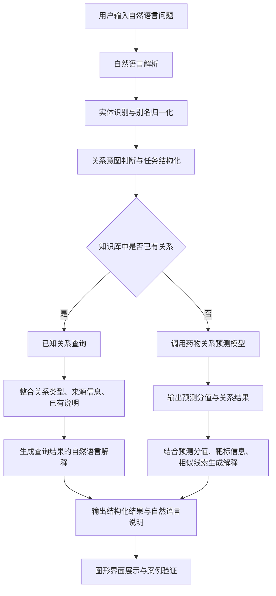
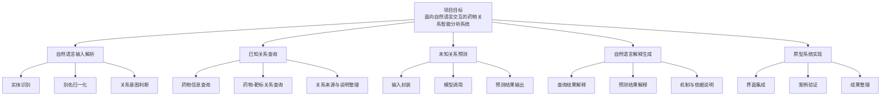
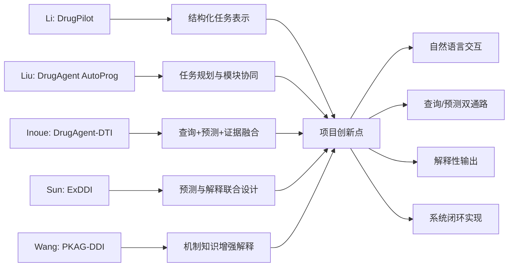
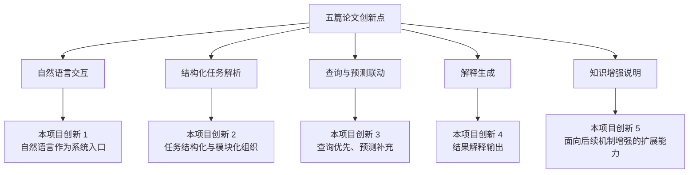

# 文献与创新点对应说明

## 一、五篇论文与本项目的对应关系

本项目并非简单复现某一篇论文，而是围绕“自然语言输入、关系查询、关系预测、结果解释、系统原型”这一目标，将五篇论文中的关键创新点进行模块化吸收，并整合为一个面向药物关系分析的完整系统。

### 1. Li 等：DrugPilot

对应创新点：参数化推理、结构化任务表示、多轮任务组织。

在本项目中的体现：

1. 将用户自然语言问题转化为结构化任务对象。
2. 将药物实体、靶标实体和关系意图拆分为独立字段进行处理。
3. 为后续查询模块和预测模块提供统一输入接口。

对应到本项目中的模块：自然语言输入解析模块。

### 2. Liu 等：DrugAgent AutoProg

对应创新点：多角色协同、任务规划与执行流程组织、面向领域任务的模块联动。

在本项目中的体现：

1. 将系统流程拆分为输入解析、关系查询、模型预测、解释生成和界面展示等模块。
2. 强调系统不只是“回答结果”，而是能够按流程组织任务。
3. 体现出从需求输入到结果输出的整体闭环设计思路。

对应到本项目中的模块：系统总体框架设计与模块协同机制。

### 3. Inoue 等：DrugAgent-DTI

对应创新点：多源证据融合推理，将机器学习预测、知识图谱路径和文献证据纳入统一框架。

在本项目中的体现：

1. 设计“已知关系优先查询、未知关系自动预测”的双通路机制。
2. 查询模块不仅返回结果，还为解释模块提供基础事实和证据来源。
3. 体现由单一模型输出向“查询 + 推断 + 说明”联合分析的转变。

对应到本项目中的模块：关系查询模块、查询与预测联动机制。

### 4. Sun 等：ExDDI

对应创新点：将自然语言解释生成作为独立任务，并强调“预测 + 解释”的联合设计。

在本项目中的体现：

1. 单独设置“自然语言解释生成”模块，而非将其视为附属展示功能。
2. 系统输出不仅包含关系结果，还包含解释性语句。
3. 项目创新点中明确提出系统需要回答“是什么关系”和“为什么得到该结果”。

对应到本项目中的模块：自然语言解释生成模块。

### 5. Wang 等：PKAG-DDI

对应创新点：成对知识增强、机制相关知识注入、事件文本生成。

在本项目中的体现：

1. 强调解释内容不能只是对预测结果的简单复述，而要尽量结合机制或依据进行说明。
2. 对已知关系优先整合已有说明和基础事实，对预测结果尝试结合分数、靶标信息、相似性线索进行增强解释。
3. 为后续引入药物对知识、机制知识和外部证据扩展解释模块预留了方向。

对应到本项目中的模块：知识增强解释模块。


## 二、本项目吸收五篇论文创新点后的整体思路

五篇论文对本项目的支撑关系可以概括为：

1. Li 和 Liu 两篇论文主要支撑“自然语言任务如何被系统组织和拆解”。
2. Inoue 主要支撑“查询与预测如何统一起来，并形成多源证据推理框架”。
3. Sun 和 Wang 主要支撑“结果如何转化为自然语言解释，并提升解释质量”。

因此，本项目的真正创新点不是单一算法，而是把以下三条线整合到一个系统中：

1. 自然语言交互。
2. 查询与预测双通路分析。
3. 解释性输出。


## 三、答辩时可直接使用的说明话术

如果老师问“这五篇论文是如何被你吸收进项目中的”，可以直接回答：

本项目不是单纯复现某一篇论文，而是对五篇论文的关键创新点进行了模块化整合。具体来说，DrugPilot 和 Liu 的 DrugAgent 为本项目提供了自然语言任务解析与系统调度思路；Inoue 的 DrugAgent-DTI 提供了“已知关系查询 + 未知关系预测 + 多源证据整合”的框架参考；ExDDI 提供了“预测结果需要自然语言解释”的核心理念；PKAG-DDI 则进一步启发我们在解释生成时引入机制知识和成对知识增强。最终，本项目形成的是一个“自然语言输入 - 关系查询/预测 - 自然语言解释输出”的完整闭环系统。


## 四、技术路线图示意

你可以把技术路线图画成如下结构：

1. 用户自然语言输入
2. 输入解析与实体识别
3. 关系类型判断与任务结构化
4. 已知关系查询
5. 若命中则生成查询结果解释
6. 若未命中则调用预测模型
7. 生成预测结果解释
8. 输出结构化结果与自然语言说明

推荐画成左右或上下流程图，核心突出“双通路”：

- 一条是“查询通路”
- 一条是“预测通路”


## 五、Mermaid 版本技术路线图

下面这版可以直接拿去生成流程图，或者照着在 PPT / ProcessOn / Visio 里重画：




## 六、适合答辩 PPT 的简化版技术路线图

如果你想在 PPT 中画得更简洁，可以只保留 6 个框：

```text
自然语言输入
→ 输入解析
→ 关系查询
→ 查询失败则进入预测
→ 解释生成
→ 结果展示
```

其中“关系查询”和“模型预测”之间用一个判断菱形连接，表示这是本项目区别于普通预测系统的重要创新点。


## 七、研究内容框架图

这张图适合放在“研究内容”或“项目总体设计”部分，用来说明系统由哪些子模块组成，以及模块之间的支撑关系。



如果你想画得更简洁，也可以压缩成 5 个并列模块：

```text
自然语言输入解析
已知关系查询
未知关系预测
自然语言解释生成
原型系统实现
```


## 八、创新点对应图

这张图适合放在“创新点”或“文献支撑”部分，用来说明五篇论文分别对应你项目的哪一块创新。



如果答辩老师更关注“你的项目到底创新在哪”，也可以换成下面这个更直接的版本：




## 九、PPT 排版建议

如果你做 6 到 8 页项目答辩 PPT，这三张图建议这样放：

1. 技术路线图：放在“技术路线”页，突出双通路机制。
2. 研究内容框架图：放在“研究内容”页，突出模块组成。
3. 创新点对应图：放在“创新点与文献支撑”页，突出你不是简单拼接，而是有文献来源的整合创新。

推荐顺序是：

研究背景
→ 国内外现状
→ 研究内容框架图
→ 技术路线图
→ 创新点对应图
→ 预期成果
→ 进度安排